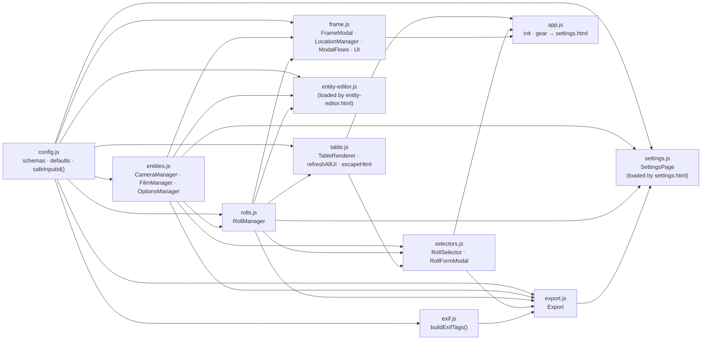
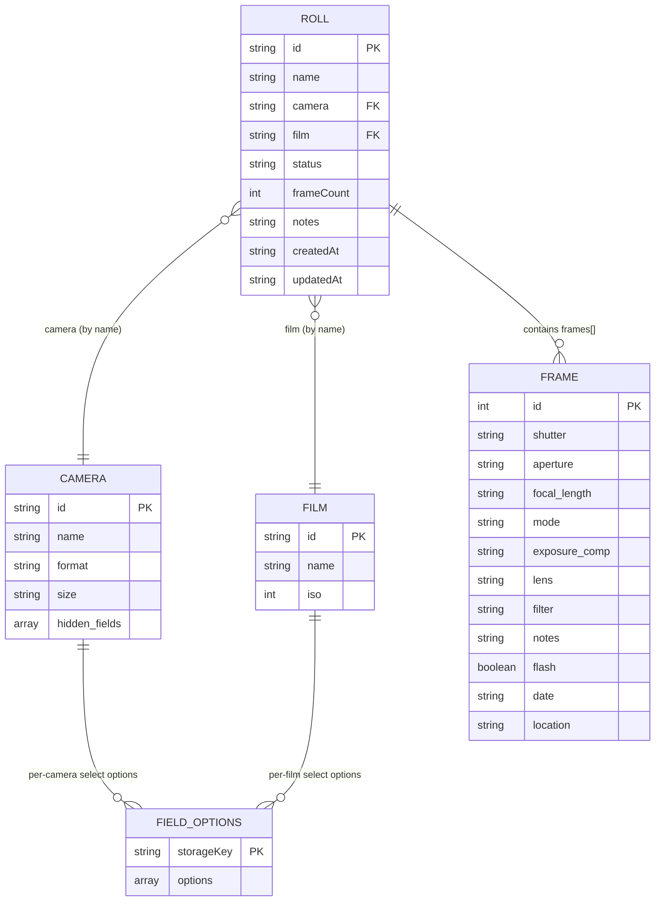
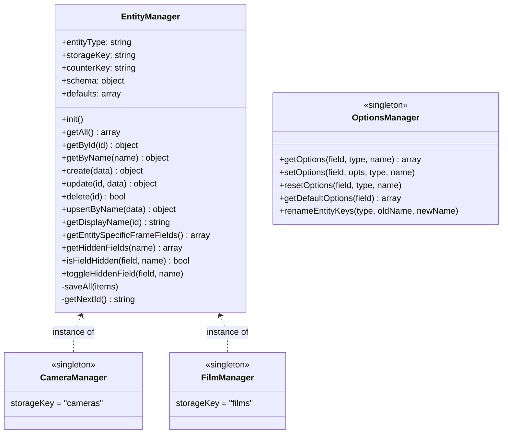
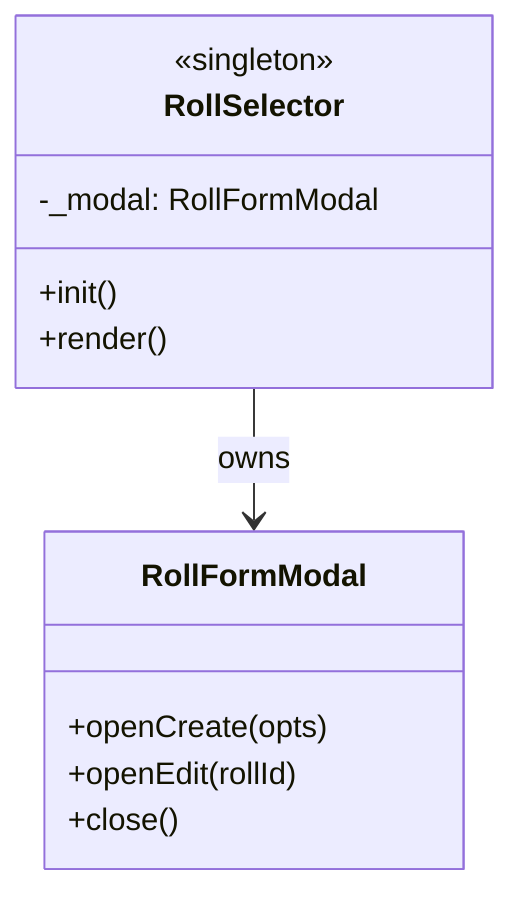
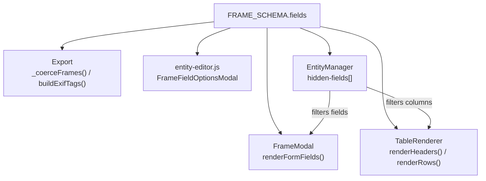

# Rolleirecord — Code Architecture

A vanilla JS PWA with **zero runtime dependencies**. All scripts are plain `<script>` tags sharing globals via load order. No bundler, no ES modules on the main branch. Three HTML entry points (main app, entity editor, settings) share one `src/` directory.

---

## Script Load Order

Three HTML entry points share the same `src/` directory:

**`index.html` — main app** (in dependency order):

```
config.js → entities.js → rolls.js → table.js →
selectors.js → export.js → frame.js → app.js
```

**`entity-editor.html` — camera/film editor page**:

```
config.js → entities.js → rolls.js → entity-editor.js
```

**`settings.html` — settings page**:

```
config.js → entities.js → rolls.js → exif.js → export.js → settings.js
```

`exif.js` feeds only CSV export, so it loads on `settings.html` only.
`export.js` loads on both `index.html` (for roll import) and `settings.html`
(for roll/CSV export).

Each file may reference globals defined by any earlier script.

---

## Module / Global Dependency Graph



> `app.js` no longer owns settings logic — the header gear button simply
> navigates to `settings.html`. `selectors.js` depends on `export.js` for the
> roll-import flow (the create dialog's "Import from file…" button).
> `settings.js` depends on `exif.js` + `export.js` for roll/CSV/backup export.

---

## Data Model Relationships



> Roll→Camera and Roll→Film references are stored as **name strings**, not
> IDs. Renaming a camera/film in `entity-editor.html` updates
> `OptionsManager`'s storage keys via `renameEntityKeys`, but does **not**
> currently cascade to existing rolls. Roll references continue to point at
> the old name until manually updated via the Roll edit modal.

---

## Class & Singleton Reference

### `config.js`

| Export                   | Kind     | Purpose                                                                                                                                                                |
| ------------------------ | -------- | ---------------------------------------------------------------------------------------------------------------------------------------------------------------------- |
| `safeInputId(fieldName)` | function | Replaces `"name"` → `"label"` in HTML `id`/`name` attrs to prevent iOS Safari autofill                                                                                 |
| `FRAME_SCHEMA`           | const    | Schema for frame fields — drives form rendering, table columns, validation, export                                                                                     |
| `CAMERA_SCHEMA`          | const    | Schema for camera entity forms                                                                                                                                         |
| `FILM_SCHEMA`            | const    | Schema for film entity forms                                                                                                                                           |
| `FORMATS`                | const    | Map of film format → valid size strings. Used as `dependent_options` for the camera `size` field (which declares `dependent_on: "format"`) to drive a cascading select |
| `ROLL_STATUSES`          | const    | Ordered list of roll lifecycle statuses                                                                                                                                |
| `DEFAULT_CAMERAS`        | const    | Seed data for first load                                                                                                                                               |
| `DEFAULT_FILMS`          | const    | Seed data for first load                                                                                                                                               |
| `DEFAULT_FRAME_COUNT`    | const    | Default frame count for new rolls (36)                                                                                                                                 |

---

### `entities.js`



`EntityManager` is a generic localStorage-backed CRUD class. On `.init()` it
seeds defaults on first load, and merges any new defaults (by name) on
subsequent loads. It also owns hidden-field management: each entity record can
carry a `hidden-fields` array of frame field names to suppress in the frame
form and table. `getEntitySpecificFrameFields()` returns the frame schema
fields whose options are scoped to this entity type (`entity_specific`).

`EntityManagers = { camera: CameraManager, film: FilmManager }` exposes both
instances by URL-friendly key, used by `entity-editor.js`.

`OptionsManager` persists customised option lists for `select` frame fields,
keyed `[entityType][entityName][fieldName] → array`. Reads from the schema
when no custom list exists. `renameEntityKeys` keeps storage keys in sync
when an entity is renamed.

---

### `rolls.js`

| Export        | Kind             | Purpose                                                                                                                                                           |
| ------------- | ---------------- | ----------------------------------------------------------------------------------------------------------------------------------------------------------------- |
| `RollManager` | object singleton | Manages the list of rolls in localStorage (`"rolls"` key). Tracks the active roll via `"current-roll-id"`. Provides roll CRUD and frame CRUD on the current roll. |

Key methods: `createRoll`, `updateRoll`, `deleteRoll`, `setCurrentRoll`, `getFrames`, `addFrame`, `updateFrame`, `deleteFrame`, `getNextSuggestedFrameId`, `getCurrentCamera`, `getCurrentFilm`.

The `getCurrentCamera()` / `getCurrentFilm()` helpers return the current roll's `camera` / `film` field, falling back to the first available camera/film when no roll is selected. These are the canonical "what camera/film is currently active" accessors used throughout the UI.

---

### `table.js`

| Export           | Kind             | Purpose                                                                                                                                                                                     |
| ---------------- | ---------------- | ------------------------------------------------------------------------------------------------------------------------------------------------------------------------------------------- |
| `TableRenderer`  | object singleton | Renders the frame table from `FRAME_SCHEMA`. `getVisibleFields()` filters to columns with `column_width`, excluding per-camera hidden fields. Normalises column widths to always fill 100%. |
| `refreshAllUI()` | function         | Re-renders the table, selector dropdowns, and UI visibility states. Called after any data mutation.                                                                                         |

---

### `selectors.js`



`RollSelector` renders the header dropdown and an edit button. The dropdown
lists rolls plus a `+ Create new roll` sentinel; selecting it opens
`RollFormModal` in create mode. The edit button opens the modal in edit mode
for the currently selected roll. `RollFormModal` builds its own DOM (it is
not derived from a generic entity modal) — it has a fixed set of fields
(name, camera, film, frame count, status, notes) and contains plain
`<select>` elements for camera and film (cameras/films are managed on the
separate `entity-editor.html` page).

In create mode, `RollFormModal` also shows an **"Import from file…"** button
that calls `Export.importRoll()` — import is offered as an alternative
creation flow rather than a standalone control, so there are no roll-file
buttons in the roll selector bar. (This is the only roll-file operation on the
main page, because import mutates the live view; roll/CSV/backup _export_ lives
on `settings.html`.)

---

### `frame.js`

| Export            | Kind             | Purpose                                                                                                                                                                   |
| ----------------- | ---------------- | ------------------------------------------------------------------------------------------------------------------------------------------------------------------------- |
| `FrameModal`      | object singleton | Add/edit modal for individual frames. Renders form from `FRAME_SCHEMA`, respecting current camera's hidden fields. Pre-fills new frames from the previous frame's data.   |
| `LocationManager` | object singleton | Wraps the Geolocation API. Formats, parses, and validates `"lat,lng"` coordinate strings. Generates Google Maps URLs. Used only by the location field flows in this file. |
| `ModalFlows`      | object           | Handles form submit logic: reads inputs, type-coerces values, calls `RollManager.addFrame` / `updateFrame`, then calls `refreshAllUI()`.                                  |
| `UI`              | object           | `openAddModal(refData?)` / `openEditModal(frameId)` — public entry points called by the FAB and table row actions.                                                        |

`FrameModal` (used inside `index.html`) and `entity-editor.js`'s
`PropertyEditModal` / `FrameFieldOptionsModal` (used inside
`entity-editor.html`) are entirely separate modal systems — they share CSS
but no JS.

---

### `entity-editor.js`

Standalone page script loaded by `entity-editor.html`. The URL parameter
`?type=camera|film` selects the entity type via `EntityManagers[type]`.

| Export                   | Kind             | Purpose                                                                                                                                                           |
| ------------------------ | ---------------- | ----------------------------------------------------------------------------------------------------------------------------------------------------------------- |
| `EntityEditorSelector`   | object singleton | Header dropdown for picking the active entity; adds/deletes entities of the current type.                                                                         |
| `PropertiesSection`      | object singleton | Renders schema-field rows. Edit button opens `PropertyEditModal`.                                                                                                 |
| `FrameFieldsSection`     | object singleton | Renders one row per entity-specific frame field with the current option list, an Enabled toggle (wired to `EntityManager.toggleHiddenField`), and an edit button. |
| `PropertyEditModal`      | object singleton | Single-field input modal. On name change, calls `OptionsManager.renameEntityKeys`. Resets dependent fields when a parent field changes.                           |
| `FrameFieldOptionsModal` | object singleton | Multi-value list editor for an entity-specific frame field — add, reorder, remove, reset to schema defaults.                                                      |

The settings page (`settings.html`) links to `/entity-editor.html?type=camera`
and `/entity-editor.html?type=film`.

---

### `exif.js`

| Export                | Kind     | Purpose                                                                                                                                          |
| --------------------- | -------- | ------------------------------------------------------------------------------------------------------------------------------------------------ |
| `buildExifTags(meta)` | function | Maps app frame fields to exiftool tag names (`Make`, `Model`, `AllDates`, `FNumber`, `ExposureTime`, `ISO`, `FocalLength`, etc.) for CSV export. |

Loaded on `settings.html` only (CSV export is a settings-page action).

---

### `export.js`

| Export   | Kind             | Purpose                                                                                                                                                                                                                                                                |
| -------- | ---------------- | ---------------------------------------------------------------------------------------------------------------------------------------------------------------------------------------------------------------------------------------------------------------------- |
| `Export` | object singleton | All import/export I/O. Single-roll JSON round-trip (`exportRoll` / `importRoll`), full localStorage backup/restore (`exportStorage` / `importStorage`), exiftool CSV export (`exportToExiftoolCSV`). Import reconciles cameras/films via `EntityManager.upsertByName`. |

Loaded on **both** `index.html` and `settings.html`. The functions are kept in
one file despite the page split because they are small, similar, and coupled
(e.g. `importRoll` reaches into the live UI via `refreshAllUI()`). On the main
page only `importRoll` is reachable (the roll create dialog's "Import from
file…" button); `exportRoll`, `exportToExiftoolCSV`, and the storage
backup/restore functions are wired up by `settings.js`.

---

### `settings.js`

Standalone page script loaded by `settings.html`.

| Export         | Kind             | Purpose                                                                                                                                                                                                               |
| -------------- | ---------------- | --------------------------------------------------------------------------------------------------------------------------------------------------------------------------------------------------------------------- |
| `SettingsPage` | object singleton | Seeds the entity/roll managers, then wires the settings page buttons: Edit Cameras/Films links (→ `entity-editor.html`, carrying the current camera/film name), Export Roll, Export CSV, full backup export/import, refresh assets, clear all (clears storage then returns to `index.html`). |

---

### `app.js`

Entry point for `index.html`. `DOMContentLoaded` calls `.init()` on all main-app
modules in order, wires the FAB and update banner, and points the header gear
button at `settings.html`. It no longer owns any settings/export logic.

---

## Schema-Driven UI Pattern

`FRAME_SCHEMA` is the central source of truth for the frame UI:



- Fields with `column_width` + `header` → appear as table columns
- Fields with `hideable: true` → can be toggled per-entity via `hidden-fields`
- Fields with `entity_specific: "<type>"` → option lists are stored per-entity-of-that-type in `OptionsManager`
- Fields with `custom_value: true` → allow typing a value not in the option list
- Field `type` drives input rendering, type coercion on save, and EXIF tag mapping
- `select` fields with `dependent_on` / `dependent_options` cascade their options from another field's current value. The dependency is honored by `PropertyEditModal` in `entity-editor.js` (cameras: format → size).

---

## localStorage Key Map

| Key               | Owner            | Contents                                                                                                 |
| ----------------- | ---------------- | -------------------------------------------------------------------------------------------------------- |
| `cameras`         | `CameraManager`  | JSON array of camera objects                                                                             |
| `camera-counter`  | `CameraManager`  | Auto-increment counter for IDs                                                                           |
| `films`           | `FilmManager`    | JSON array of film objects                                                                               |
| `film-counter`    | `FilmManager`    | Auto-increment counter for IDs                                                                           |
| `rolls`           | `RollManager`    | JSON array of roll objects (each contains `frames[]`)                                                    |
| `roll-counter`    | `RollManager`    | Auto-increment counter for roll IDs                                                                      |
| `current-roll-id` | `RollManager`    | ID of the currently active roll                                                                          |
| `fieldOptions`    | `OptionsManager` | JSON object `{ [entityType]: { [entityName]: { [fieldName]: string[] } } }` of customised select options |
