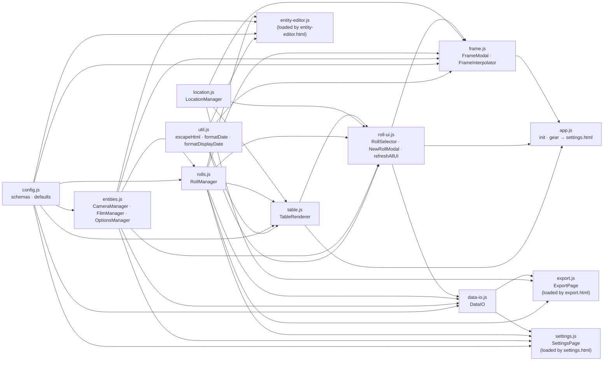
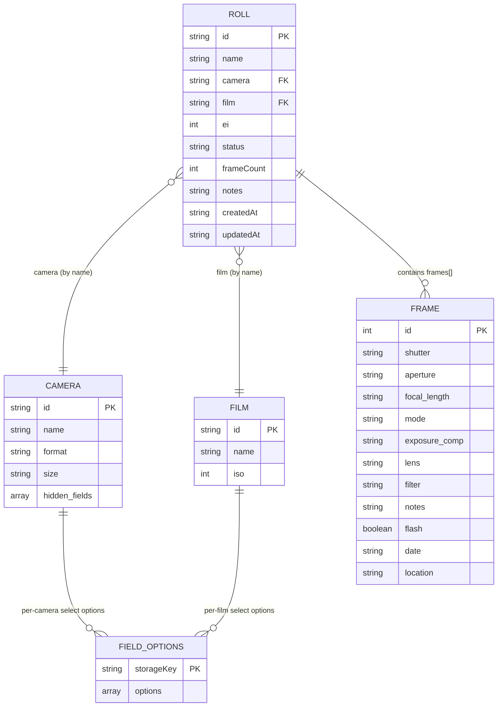
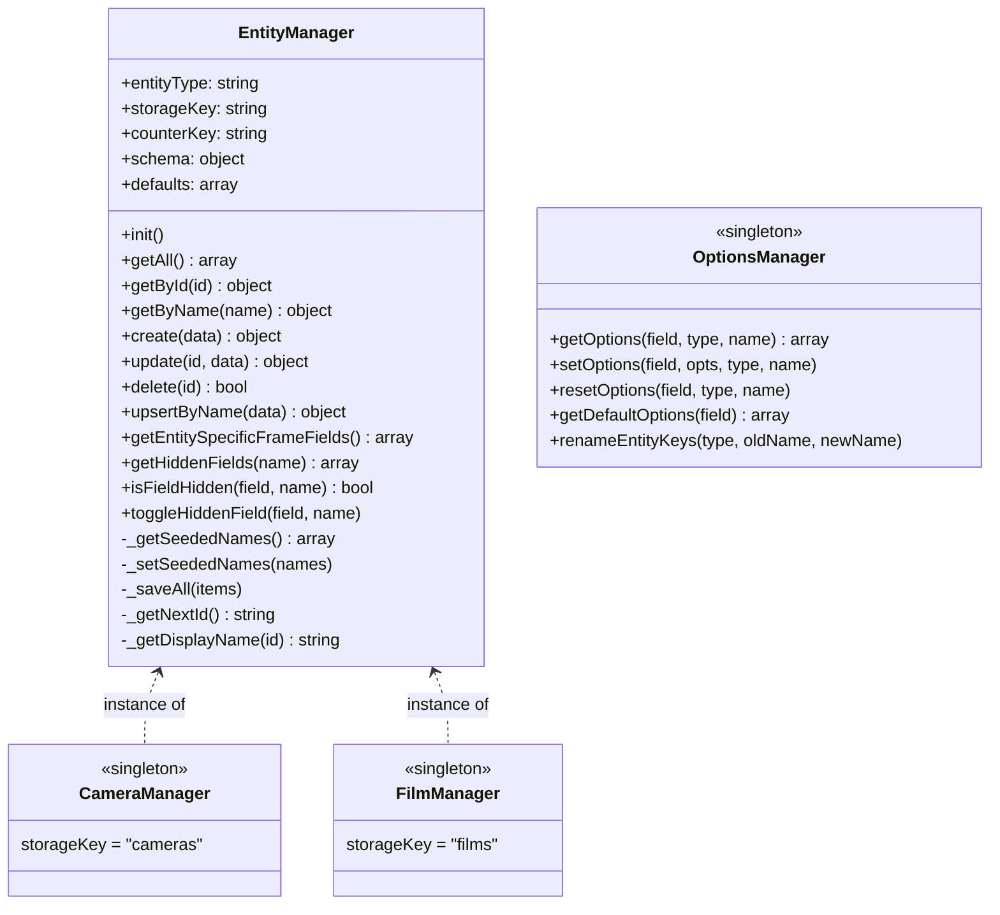
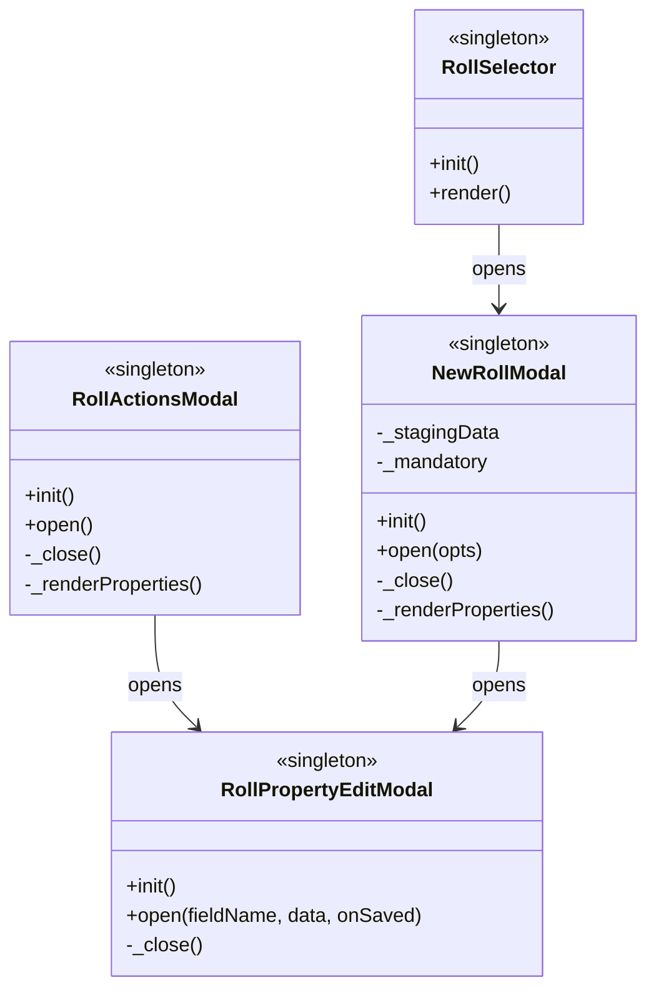
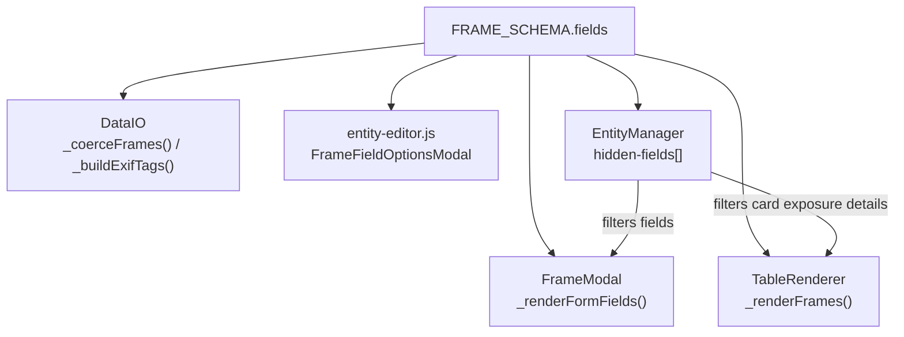

# Rolleirecord — Code Architecture

A vanilla JS PWA with **zero runtime dependencies**. All scripts are plain `<script>` tags sharing globals via load order. No bundler, no ES modules on the main branch. Four HTML entry points (main app, entity editor, scan matching export, settings) share one `src/` directory.

---

## Script Load Order

Four HTML entry points share the same `src/` directory:

**`index.html` — main app** (in dependency order):

```
util.js → config.js → entities.js → rolls.js → location.js → table.js →
roll-ui.js → data-io.js → frame.js → app.js
```

**`entity-editor.html` — camera/film editor page**:

```
util.js → config.js → entities.js → rolls.js → entity-editor.js
```

**`export.html` — scan matching and CSV export page**:

```
util.js → config.js → entities.js → rolls.js → data-io.js → location.js →
export.js
```

**`settings.html` — settings page**:

```
util.js → config.js → entities.js → rolls.js → data-io.js → settings.js
```

`util.js` holds pure, dependency-free helpers (`escapeHtml`, `formatDate`,
`formatDisplayDate`) and loads first on every page.
`data-io.js` loads on `index.html` (for roll import and roll/CSV export via the
roll actions modal), `export.html`, and `settings.html` (for full backup
export/restore).

Each file may reference globals defined by any earlier script.

---

## Module / Global Dependency Graph



> `util.js` holds pure, dependency-free helpers and is consumed by any page
> that renders HTML. `refreshAllUI()` now lives in `roll-ui.js` (it
> orchestrates `RollSelector` + `TableRenderer`), so `table.js` is a pure
> provider with no forward references.
> `app.js` no longer owns settings logic — the header gear button simply
> navigates to `settings.html`. `roll-ui.js` depends on `data-io.js` for the
> roll-import flow (`NewRollModal`'s "Import from file…" button) and roll JSON
> export via `RollActionsModal`; the CSV row navigates to `export.html`.
> `export.js` depends on `data-io.js` to generate ExifTool CSV rows with
> scan filenames supplied by the matching UI. `settings.js` depends on
> `data-io.js` for backup export/import.

---

## Data Model Relationships



> Roll→Camera and Roll→Film references are stored as **name strings**, not
> IDs. Renaming a camera/film in `entity-editor.html` updates
> `OptionsManager`'s storage keys via `renameEntityKeys`, but does **not**
> currently cascade to existing rolls. Roll references continue to point at
> the old name until manually updated via the Roll edit modal.
>
> Each roll stores its exposure index (`ei`) separately from its film's box
> speed (`film.iso`). New rolls default EI to the selected film's box speed;
> CSV/ExifTool exports use the roll EI for their ISO metadata.

---

## Class & Singleton Reference

### `util.js`

| Export                     | Kind     | Purpose                                                                    |
| -------------------------- | -------- | -------------------------------------------------------------------------- |
| `escapeHtml(text)`         | function | Escapes text for safe interpolation into HTML strings (used on every page) |
| `formatDate(date)`         | function | Formats a `Date` for storage in local datetime fields                      |
| `formatDisplayDate(value)` | function | Formats a stored date for localized display with a safe fallback           |

Pure, dependency-free helpers. Loads first on every entry point so any later
module can use them.

---

### `config.js`

| Export                | Kind  | Purpose                                                                                                                                                                |
| --------------------- | ----- | ---------------------------------------------------------------------------------------------------------------------------------------------------------------------- |
| `FRAME_SCHEMA`        | const | Schema for frame fields — drives form rendering, card exposure details (`in_card`), validation, and export                                                             |
| `CAMERA_SCHEMA`       | const | Schema for camera entity forms                                                                                                                                         |
| `FILM_SCHEMA`         | const | Schema for film entity forms                                                                                                                                           |
| `ROLL_FIELDS`         | const | Schema for roll fields (name, camera, film, frameCount, status, notes) — drives the roll actions modal property editor and new-roll staging form                       |
| `FORMATS`             | const | Map of film format → valid size strings. Used as `dependent_options` for the camera `size` field (which declares `dependent_on: "format"`) to drive a cascading select |
| `ROLL_STATUSES`       | const | Ordered list of roll lifecycle statuses                                                                                                                                |
| `DEFAULT_CAMERAS`     | const | Seed data for first load                                                                                                                                               |
| `DEFAULT_FILMS`       | const | Seed data for first load                                                                                                                                               |
| `DEFAULT_FRAME_COUNT` | const | Default frame count for new rolls (36)                                                                                                                                 |

---

### `entities.js`



`EntityManager` is a generic localStorage-backed CRUD class. On `.init()` it
seeds defaults on first load, and on subsequent loads merges only defaults that
have never been introduced before, tracked via a per-type `<storageKey>-seeded`
registry of default names. A default the user has deleted or renamed keeps its
original name in that registry, so it is not resurrected on reload; only newly
added defaults are merged in. (Storage predating the registry is migrated by
recording all current default names as already seeded, preserving prior
deletions.) It also owns hidden-field management: each entity record can
carry a `hidden-fields` array of frame field names to suppress in the frame
form and table. `getEntitySpecificFrameFields()` returns the frame schema
fields whose options are scoped to this entity type (`entity_specific`).

`EntityManagers = { camera: CameraManager, film: FilmManager }` exposes both
instances by URL-friendly key, used by `entity-editor.js`.

`OptionsManager` persists customised option lists for `select` frame fields,
keyed `[entityType][entityName][fieldName] → array`. Reads from the schema
when no custom list exists. `renameEntityKeys` keeps storage keys in sync
when an entity is renamed.

---

### `rolls.js`

| Export        | Kind             | Purpose                                                                                                                                                           |
| ------------- | ---------------- | ----------------------------------------------------------------------------------------------------------------------------------------------------------------- |
| `RollManager` | object singleton | Manages the list of rolls in localStorage (`"rolls"` key). Tracks the active roll via `"current-roll-id"`. Provides roll CRUD and frame CRUD on the current roll. |

Key methods: `createRoll`, `updateRoll`, `deleteRoll`, `setCurrentRoll`, `getFrames`, `addFrame`, `updateFrame`, `deleteFrame`, `getNextSuggestedFrameId`, `getCurrentCamera`, `getCurrentFilm`.

The `getCurrentCamera()` / `getCurrentFilm()` helpers return the current roll's `camera` / `film` field, falling back to the first available camera/film when no roll is selected. These are the canonical "what camera/film is currently active" accessors used throughout the UI.

---

### `table.js`

| Export          | Kind             | Purpose                                                                                                                                                                             |
| --------------- | ---------------- | ----------------------------------------------------------------------------------------------------------------------------------------------------------------------------------- |
| `TableRenderer` | object singleton | Renders the active roll as expanded, tappable frame rows. Each row groups exposure metadata and notes on the left with an explicit date and reverse-geocoded location on the right. |

It depends on the earlier `config`, `rolls`, and `entities` modules, and uses
`LocationManager` at render time to resolve location labels. `location.js`
loads before `table.js`, so that lookup introduces no forward reference.

Private helpers select the active camera's non-hidden `FRAME_SCHEMA` fields
marked `in_card`, render their header/label and value as the left-side exposure
summary, and sort frames by descending ID before creating the card list. Date
values are locale-formatted, and missing date/location values use explicit
unavailable labels. Reverse geocoding returns the coordinate string while an
asynchronous lookup is pending, then updates the matching label in place.

---

### `roll-ui.js`



In addition to the singletons above, `roll-ui.js` defines `refreshAllUI()` —
a free function that re-renders both roll-dependent surfaces
(`RollSelector.render()` + `TableRenderer.render()`). It lives here because it
orchestrates `RollSelector` and `TableRenderer`, and every caller
(`roll-ui.js`, `data-io.js`, `frame.js`, `app.js`) loads at or after this
point, so no forward references are introduced.

`RollSelector` renders the header dropdown. The dropdown lists rolls plus a
`+ Create new roll` sentinel; selecting it opens `NewRollModal`.

`NewRollModal` is a bottom-sheet for creating a roll. It holds a `_stagingData`
object pre-filled with defaults and renders each field from `ROLL_FIELDS` as a
tappable `settings-row`. Tapping a row opens `RollPropertyEditModal` with the
staging data; saves update the staging object in memory. The footer has
**Create Roll**, **Cancel**, and **Import from file…** buttons. The import
button calls `DataIO.importRoll()` as an alternative creation path.

`RollActionsModal` is a bottom-sheet opened by the bottom-left FAB
(`#rollActionsFab`). It contains:

- **Properties** — live roll fields rendered from `ROLL_FIELDS` as `settings-row`
  items; tapping a row opens `RollPropertyEditModal` which saves directly to
  `RollManager`.
- **Map** — opens frame coordinates in the configured maps provider.
- **Export** — JSON roll export and navigation to the scan matching CSV export
  page (previously both exports ran directly from this modal).
- **Danger Zone** — delete roll.

`RollPropertyEditModal` is a generic single-field bottom-sheet that appears on
top of either `RollActionsModal` or `NewRollModal` (z-index 1010, transparent
backdrop). It accepts `(fieldName, data, onSaved)` — a plain data object and a
callback — so it is not coupled to any specific data source. The `onSaved`
callback may return `false` to cancel the close (used by `RollActionsModal` for
the camera-change confirmation prompt). While active, `RollPropertyEditModal`
dims the parent sheet via a `dimmed` class on its `.modal-content`.

---

### `location.js`

| Export            | Kind             | Purpose                                                                                                                                                                                                               |
| ----------------- | ---------------- | --------------------------------------------------------------------------------------------------------------------------------------------------------------------------------------------------------------------- |
| `LocationManager` | object singleton | Wraps the Geolocation API. Formats, parses, and validates `"lat,lng"` coordinate strings; generates Maps URLs; and reverse-geocodes locations through Nominatim (results cached in localStorage up to 1,000 entries). |

Loaded by `index.html` and `export.html` before modules that render location
labels. Keeping it separate prevents the export page from loading the
frame-editing UI solely for shared location utilities.

---

### `frame.js`

| Export              | Kind             | Purpose                                                                                                                                                                                                                                                                                                                                                                                            |
| ------------------- | ---------------- | -------------------------------------------------------------------------------------------------------------------------------------------------------------------------------------------------------------------------------------------------------------------------------------------------------------------------------------------------------------------------------------------------- |
| `FrameModal`        | object singleton | Add/edit modal for individual frames. Renders form from `FRAME_SCHEMA`, respecting current camera's hidden fields. Pre-fills new frames from the previous frame's data. Public interface via `openAddModal()` / `openEditModal(frameId)` called by the FAB and table row actions.                                                                                                                  |
| `FrameInterpolator` | object singleton | Fills gaps in a roll's frame numbering. Private `_interpolateFrame(index, prevFrame, nextFrame)` builds one interpolated frame (copies `prevFrame`, linearly interpolates `date`/`location` by index distance, sets a note). Public `interpolateFramesInRoll(frames)` finds all gaps and returns the interpolated frames for each. Called by `roll-ui.js`'s `RollActionsModal` interpolate button. |

`FrameModal` (used inside `index.html`) and `entity-editor.js`'s
`PropertyEditModal` / `FrameFieldOptionsModal` (used inside
`entity-editor.html`) are entirely separate modal systems — they share CSS
but no JS.

---

### `entity-editor.js`

Standalone page script loaded by `entity-editor.html`. The URL parameter
`?type=camera|film` selects the entity type via `EntityManagers[type]`.

| Export                   | Kind             | Purpose                                                                                                                                                           |
| ------------------------ | ---------------- | ----------------------------------------------------------------------------------------------------------------------------------------------------------------- |
| `EntityEditorSelector`   | object singleton | Header dropdown for picking the active entity; adds/deletes entities of the current type.                                                                         |
| `PropertiesSection`      | object singleton | Renders schema-field rows. Edit button opens `PropertyEditModal`.                                                                                                 |
| `FrameFieldsSection`     | object singleton | Renders one row per entity-specific frame field with the current option list, an Enabled toggle (wired to `EntityManager.toggleHiddenField`), and an edit button. |
| `PropertyEditModal`      | object singleton | Single-field input modal. On name change, calls `OptionsManager.renameEntityKeys`. Resets dependent fields when a parent field changes.                           |
| `FrameFieldOptionsModal` | object singleton | Multi-value list editor for an entity-specific frame field — add, reorder, remove, reset to schema defaults.                                                      |

The settings page (`settings.html`) links to `/entity-editor.html?type=camera`
and `/entity-editor.html?type=film`.

---

### `data-io.js`

| Export                             | Kind             | Purpose                                                                                                                                                                                                                                                                |
| ---------------------------------- | ---------------- | ---------------------------------------------------------------------------------------------------------------------------------------------------------------------------------------------------------------------------------------------------------------------- |
| `_buildExifTags(meta, sourceFile)` | function         | Maps app frame fields to exiftool tag names (`Make`, `Model`, `AllDates`, `FNumber`, `ExposureTime`, `ISO`, `FocalLength`, etc.) for CSV export, optionally overriding `SourceFile`. Private to this module.                                                           |
| `DataIO`                           | object singleton | All import/export I/O. Single-roll JSON round-trip (`exportRoll` / `importRoll`), full localStorage backup/restore (`exportStorage` / `importStorage`), exiftool CSV export (`exportToExiftoolCSV`). Import reconciles cameras/films via `EntityManager.upsertByName`. |

Loaded on `index.html`, `export.html`, and `settings.html`. On the main page,
`importRoll` is reachable via `NewRollModal`'s "Import from file…" button, and
`exportRoll` is reachable via `RollActionsModal`; its CSV row navigates to
`export.html`. The export page supplies its captured roll snapshot alongside
matched frame IDs and scan filenames to `exportToExiftoolCSV`. The storage
backup/restore functions are wired up by `settings.js` only.

**Single-roll JSON format** (`exportRoll` / `importRoll`) — a roll-level object,
not a flat frame array:

```json
{
  "name": "Roll Name",
  "frameCount": 36,
  "status": "Loaded",
  "notes": "",
  "camera": { "name": "...", "format": "...", "size": "...", "hidden-fields": [] },
  "film": { "name": "...", "iso": 400 },
  "frames": [{ "id": 1, "shutter": "1/125s", ... }]
}
```

On import, camera/film entities are reconciled via
`EntityManager.upsertByName()` — created if missing, updated if properties
differ.

---

### `export.js`

Standalone page controller loaded by `export.html`. `ExportPage` reads the
active roll, natural-sorts locally selected scan files, and matches included
files to logged frames in ascending ID order from a configurable first frame.
It owns preview object URLs, reverse/exclude/clear controls, match summaries,
and passes matched frame IDs with the original filenames to
`DataIO.exportToExiftoolCSV` alongside the captured roll snapshot.

---

### `settings.js`

Standalone page script loaded by `settings.html`.

| Export         | Kind             | Purpose                                                                                                                                                                                                                                                             |
| -------------- | ---------------- | ------------------------------------------------------------------------------------------------------------------------------------------------------------------------------------------------------------------------------------------------------------------- |
| `SettingsPage` | object singleton | Seeds the entity/roll managers, then wires the settings page buttons: Edit Cameras/Films links (→ `entity-editor.html`, carrying the current camera/film name), full backup export/import, refresh assets, clear all (clears storage then returns to `index.html`). |

---

### `app.js`

Entry point for `index.html`. `DOMContentLoaded` calls `.init()` on all main-app
modules in order, wires the FAB and update banner, and points the header gear
button at `settings.html`. It no longer owns any settings/export logic.

---

## Schema-Driven UI Pattern

`FRAME_SCHEMA` is the central source of truth for the frame UI:



- Fields with `in_card: true` → appear in the frame card exposure summary
- Entity-specific fields can be toggled per-entity via `hidden-fields`
- Fields with `entity_specific: "<type>"` → option lists are stored per-entity-of-that-type in `OptionsManager`
- Fields with `custom_value: true` → allow typing a value not in the option list
- Field `type` drives input rendering, type coercion on save, and EXIF tag mapping
- `select` fields with `dependent_on` / `dependent_options` cascade their options from another field's current value. The dependency is honored by `PropertyEditModal` in `entity-editor.js` (cameras: format → size).

---

## localStorage Key Map

| Key                        | Owner             | Contents                                                                                                                |
| -------------------------- | ----------------- | ----------------------------------------------------------------------------------------------------------------------- |
| `cameras`                  | `CameraManager`   | JSON array of camera objects                                                                                            |
| `camera-counter`           | `CameraManager`   | Auto-increment counter for IDs                                                                                          |
| `cameras-seeded`           | `CameraManager`   | JSON array of default camera names already introduced (suppresses re-seeding deleted/renamed defaults)                  |
| `films`                    | `FilmManager`     | JSON array of film objects                                                                                              |
| `film-counter`             | `FilmManager`     | Auto-increment counter for IDs                                                                                          |
| `films-seeded`             | `FilmManager`     | JSON array of default film names already introduced (suppresses re-seeding deleted/renamed defaults)                    |
| `rolls`                    | `RollManager`     | JSON array of roll objects (each contains `frames[]`)                                                                   |
| `roll-counter`             | `RollManager`     | Auto-increment counter for roll IDs                                                                                     |
| `current-roll-id`          | `RollManager`     | ID of the currently active roll                                                                                         |
| `fieldOptions`             | `OptionsManager`  | JSON object `{ [entityType]: { [entityName]: { [fieldName]: string[] } } }` of customised select options                |
| `maps-provider`            | `SettingsPage`    | Selected maps provider for frame location links (`google` \| `apple` \| `osm`); read by `LocationManager.getMapsUrl()`  |
| `rgc-enabled`              | `SettingsPage`    | Enable reverse geocoding using Nominatim API; read by `LocationManager.getReverseGeocode()`                             |
| `reverse-geocode-cache-v1` | `LocationManager` | JSON object mapping normalized `"lat,lng"` coordinate strings to Nominatim display names; bounded to 1,000 FIFO entries |
